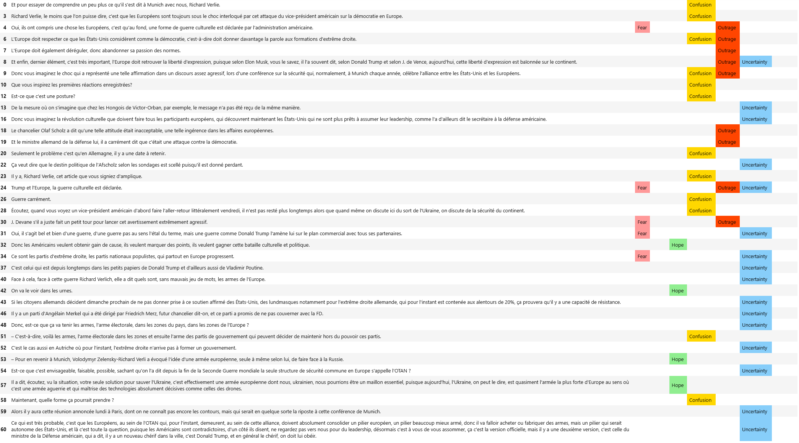

# Analyse d'émotions

## Présentation

Ce projet vise à extraire, transcrire et analyser les émotions contenues dans les transcriptions d'audios, avec un exemple issu de France24.

## Structure du Projet

### **1. Notebook principal**

📌 [**Emotions.ipynb**](Emotions.ipynb) → Notebook central où toutes les étapes du traitement et de l’analyse sont réalisées.

### **2. Données** ([`data/`](data/))

Ce dossier contient les fichiers de travail :

- 📄 [**France24.txt**](data/France24.txt) : Texte brut issu de la transcription.
- 📊 [**France24_chunks.csv**](data/France24_chunks.csv) : Texte découpé en segments analytiques.
- 🏷️ [**France24_annotated.csv**](data/France24_annotated.csv) : Texte annoté avec les émotions détectées.
- 📑 [**annotated_dataset.csv**](data/annotated_dataset.csv) : Ensemble de données enrichi avec les labels émotionnels.
- 📝 [**annotated_output.csv**](data/annotated_output.csv) : Résultat final du pipeline d'annotation.
- 🎙️ [**transcription.txt**](data/transcription.txt) : Fichier texte issu de la transcription automatique.

### **3. Résultats**

📊 Les résultats finaux de l’analyse des émotions sont illustrés ci-dessous :

## Instructions d’Utilisation

1. Ouvrir **[Emotions.ipynb](Emotions.ipynb)** dans Jupyter Notebook.
2. Exécuter les cellules une par une pour lancer le pipeline.
3. Explorer les résultats visuels et textuels.

🚀 **Analysez les émotions en un clic !**

